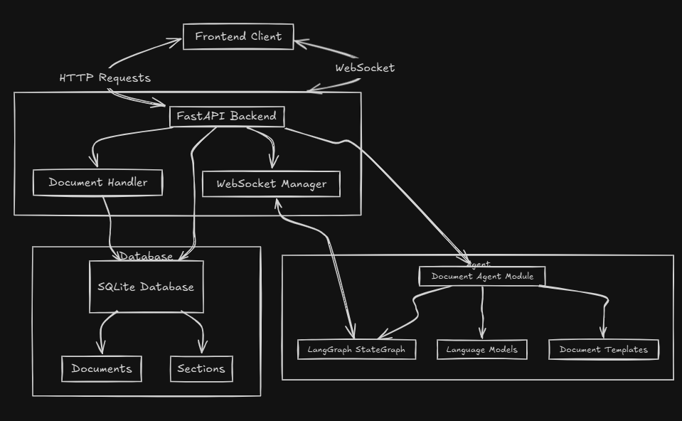

# Document Agent Assignment

## Project Architecture

This project is a document generation system that uses AI to create structured documents based on user queries and selected templates.

### System Components

- **Frontend**: Client interface for submitting document generation requests and viewing results
- **Tip Tap Editor**: when the backend sends the streamed data to the frontend through  websocket then the content is parsed through custom parser and then updated on the editor
- **Backend (FastAPI)**: Handles API endpoints and WebSocket connections
- **Database**: Stores documents and sections
- **Document Agent**: AI-powered document generation system

### Key Features

- Template-based document generation
- Real-time document creation via WebSockets
- Section-by-section content generation
- User feedback integration

### LangGraph:
